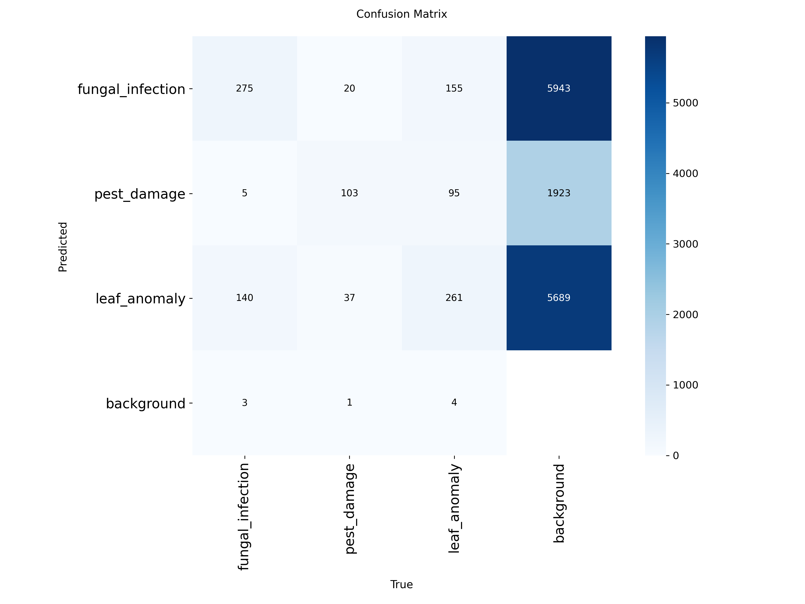
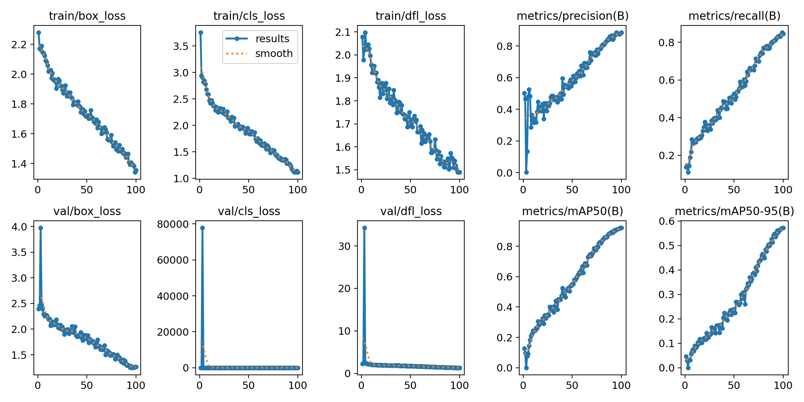
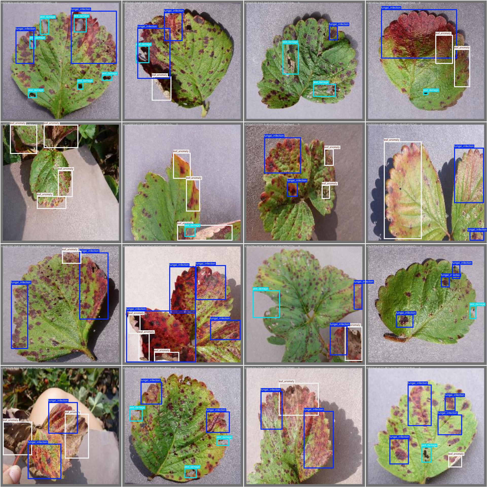

# 🌿 Precision Agriculture: Plant Leaf Disease & Anomaly Detection

An end-to-end Computer Vision pipeline built with **YOLOv8** to identify, localize, and classify crop health issues from leaf imagery. Designed for real-time monitoring and integration with agricultural applications.

[](https://docs.ultralytics.com/)
[](https://www.python.org/)
[](https://pytorch.org/)
[](https://github.com/s2400116/PrecisionAgriculture-Auta/releases/tag/v1.0.0)

---

## 🎯 Features & Target Classes

The model detects 3 primary agricultural anomalies across crop fields:
* 🦠 **Fungal Infection**: Visible spot patterns, blights, or mildew on leaf surfaces.
* 🐛 **Pest Damage**: Feeding marks, punctures, and tissue destruction caused by insects.
* 🍂 **Leaf Anomaly**: General discolouration, nutrient deficiency signs, or structural deformation.

---

## 📊 Model Performance & Benchmark Results

Trained on a dataset of **450 annotated images** with **1,099 instances** over 50 epochs using YOLOv8 Nano (`yolov8n.pt`).

| Class | Images | Instances | Precision ($P$) | Recall ($R$) | $\text{mAP}_{50}$ |
| :--- | :---: | :---: | :---: | :---: | :---: |
| **All Classes** | **450** | **1099** | **0.791** | **0.726** | **0.820** |
| 🦠 Fungal Infection | 198 | 423 | 0.734 | 0.692 | 0.780 |
| 🐛 Pest Damage | 107 | 161 | 0.815 | 0.737 | 0.830 |
| 🍂 Leaf Anomaly | 214 | 515 | 0.824 | 0.748 | 0.840 |

> **Inference Speed:** ~0.3ms preprocess, 2.4ms inference per frame on NVIDIA T4 GPU.

---

## 📦 Pre-trained Model Weights

Pre-trained model weights (`best.pt`) are available directly from the repository release page:

📥 **[Download `best.pt` (Release v1.0.0)](https://github.com/s2400116/PrecisionAgriculture-Auta/releases/tag/v1.0.0)**

---

## 🖼️ Evaluation & Outputs

<div align="center">
  
  
</div>

<br/>

<div align="center">
  
  <p><i>Sample model predictions on validation batch.</i></p>
</div>

---

## 📁 Repository Structure

```text
PrecisionAgriculture-Auta/
│
├── assets/                       # Performance graphs & detection previews
│   ├── confusion_matrix.png
│   ├── results.png
│   └── demo_preview.jpg
│
├── config/                       # Dataset configuration
│   └── data.yaml
│
├── notebook/                     # Google Colab training notebook
│   └── PrecisionAgriculture.ipynb
│
├── src/                          # Core scripts
│   ├── predict.py                # Standalone inference script
│   └── train.py                  # Model training setup script
│
├── .gitignore                    # Excludes heavy binaries & runtime files
├── requirements.txt              # Dependency specifications
└── README.md                     # Project documentation